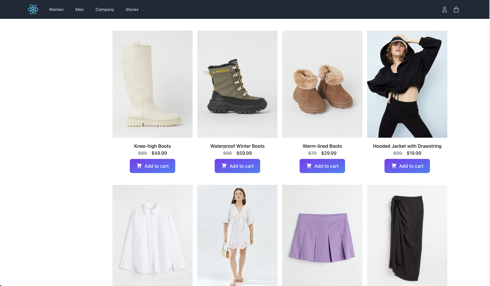

# react-shopping-cart

Simple eCommerce web application built with Typescript, ReactJS, Tailwindcss

  

## Features

- [ ] Filter products
- [ ] Cart drawer

## Getting started

- Make sure your NodeJS and npm versions are up to date for `React 18`
- Install dependencies: `yarn`
- Run: `yarn run dev`
- Views are on `localhost:5173`

## Resources

- [Headless UI](https://headlessui.com/)
- [Flowbite](https://flowbite.com/docs/getting-started/quickstart/)

## License

Distributed under the MIT license. See LICENSE for details.
